

# RNA (Rhythm-Note Alignment)

This is the description page for RNA, a symbolic music similarity measure using a modified version of local alignment. RNA uses a substitution function which consider the pitch class and the difference in the onset for each possible match.
We also present a comparison made with these other similarity measures:
  * Euclidean Distance
  * Correlation Distance
  * City Block Distance
  * Local Alignment
  * SIAM
  * BSpline

Based on the work by  [Janssen, et. al. (2015)](https://dspace.library.uu.nl/handle/1874/321370 ) and [Janssen, et. al. (2017)](https://www.tandfonline.com/doi/pdf/10.1080/09298215.2017.1316292). We use the same MTC-ANN dataset, version 2.0.1, available [here](http://www.liederenbank.nl/mtc/#), the pieces were preprocessed just to change the extension to musicxml files.

The following sections describe the experiments and link to the code used on each one.

 * [How it works?](#how-it-works?)
 * [Controlled Experiments](#controlled-experiments)
 * [Comparison with Expert annotations](#Comparison-with-expert-annotations)
 * [Case study using Impro-Visor](#case-study-using-impro-visor)

## How it works?

The formal definition represents the relation between the length of the Longest Common Subsequence (*LCS*) and the length of the longest melody from the two compared melodies *A* and *B*.

$$ RNA(A,B) = (1 - \frac{LCS_{A,B}}{\max{(|A|,|B|)}}) $$

Given two melodies *A* and *B* represented as sequences of pitch classes (pitches without considering the octave), the LCS can be obtained following a modified version of the Local Alignment algorithm as follows:

$$ 

\begin{split}
    LCS(i,j) =&
    \begin{cases} 
        0, \text{if } i=0 \text{ or } j=0 \\
        \\
        LCS(i - 1,j - 1) + 1, \\ \text{ if } \\ A[i] = B[j] \bigwedge (T_{A}[i] - T_{B}[i]) < \\ \frac{(T_{A}[i] + T_{B}[i])}{CE}\\
        \\
        \max{(LCS(i - 1,j), LCS(i,j - 1))}, \\ \text{ otherwise }\\
    \end{cases}
\end{split}

$$

Where *T* is the array with the time differences between consecutive notes in the sequence and *CE* is the scale which handles the threshold in the time difference to still be considered a match. Experimentally the overall best results were obtained with *CE=64*. The first call of *LCS* is passing as arguments *i* and *j* equal to the corresponding lengths of the sequences.

## Controlled Experiments

In these experiments a melody is modified with 4 types of modifications and by percentages (10, 20, ..., 100). The expected value from each similarity measure after normalization should be equal to the percentage of the modification, for example a melody modified by 10% should have a distance of 0.1 with the original, and of 1.0 for a 100% modification.

The tested modifications made on the melody are:

 * Pitch: A pitch in a random position is replaced for a random pitch in the MIDI range.
 * Duration: The ticks value for a pitch in a random position is modified with a random value in the range (1 y 4096), the range for a measure in 4/4.
 * Pitch and Duration: A pitch in a random position has both pitch and tick value modified by random values described previously.
 * Elimination: Random notes are removed from the melody.
 * Insertion: Random notes are inserted to the melody.

The experiments were conducted using implementations based from [Janssen](https://github.com/BeritJanssen/MelodicOccurrences) and [Urbano](https://github.com/julian-urbano/MelodyShape) in the case of BSpline.

The corresponding Jupyter notebooks can be found in this respository following this [link](https://github.com/Sirivasv/RNA/tree/main/ControlledExperiments).

### Results

Average Difference by percentage:

Average Difference by Modification Type:

## Comparison with Expert annotations

As reviewed in [Janssen, et. al. (2017)](https://www.tandfonline.com/doi/pdf/10.1080/09298215.2017.1316292) a classification can be made on the matches found when comparing two melodies in order to compare it with the experts annotations by varying the threshold and ploting the ROC curve.

A modified version of this experiment was made, the main difference is using the similarity measures on all the possible comparissons annotated, that is compare each phrase of each tune to each other per tune family using all 7 similarity measures. The annotations are converted to 0 (identical), 0.5 (somewhat similar) and 1.0 (distinct). To make binary classifications we filtered and splited the data for 3 disctinct experiments. Each experiment took a pair to make the classification. The 3 possible pairs are: 0-0.5, 0.5-1 and 0-1. The reported graph is by taking the majority annotation, if no annotation has the majority the segment is not considered. And for further analysis the same experiments were replicated with filtered segments with an unanimity votes.

The corresponding Jupyter notebooks can be found in this respository following this [link](https://github.com/Sirivasv/RNA/tree/main/ROC_Analysis). The notebook with the results can be found [here](https://github.com/Sirivasv/RNA/blob/main/ROC_Analysis/ROC_ANALYSIS.ipynb).

### Results using Majority Vote
#### Classification (0-0.5)
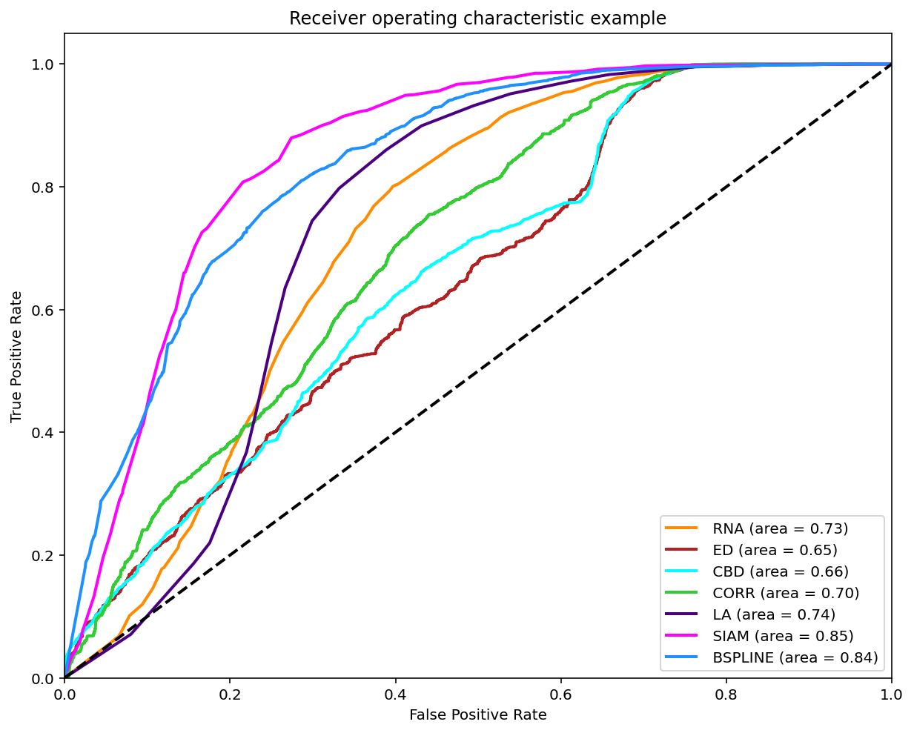
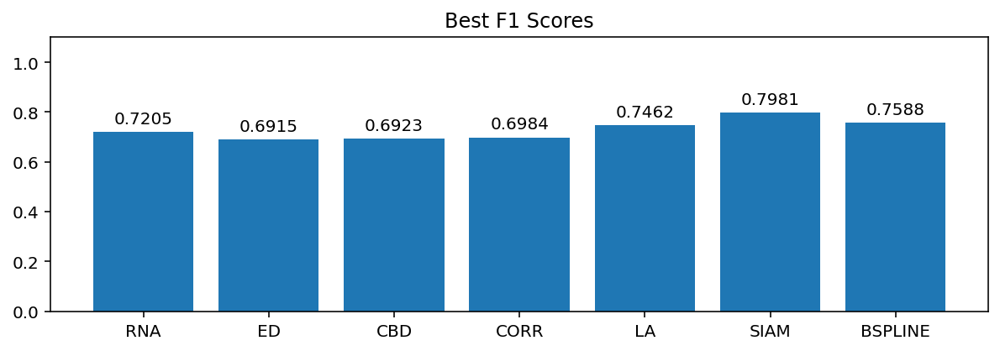
#### Classification (0.5-1)
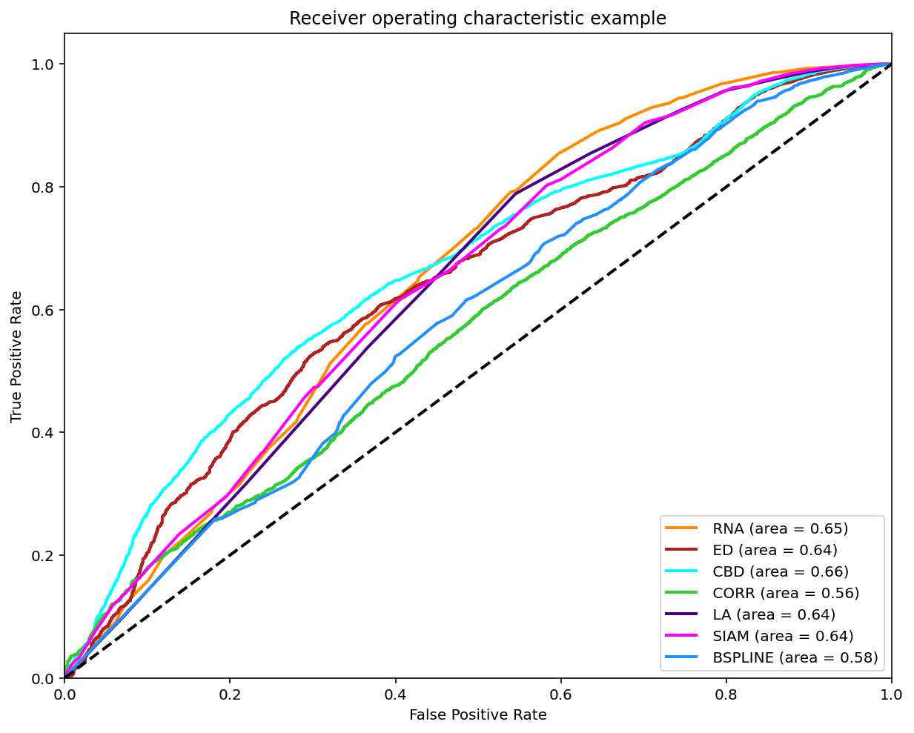
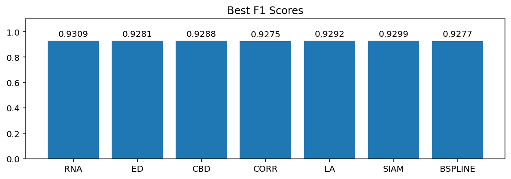
#### Classification (0-1)
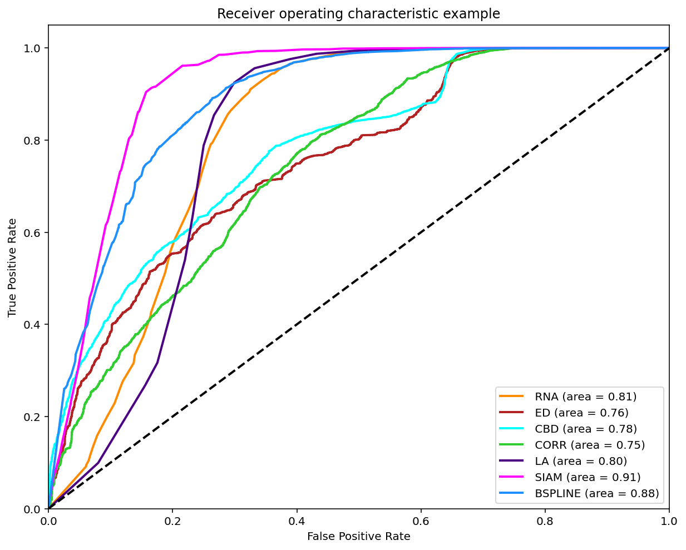

### Results using Unanimity Vote
#### Classification (0-0.5)
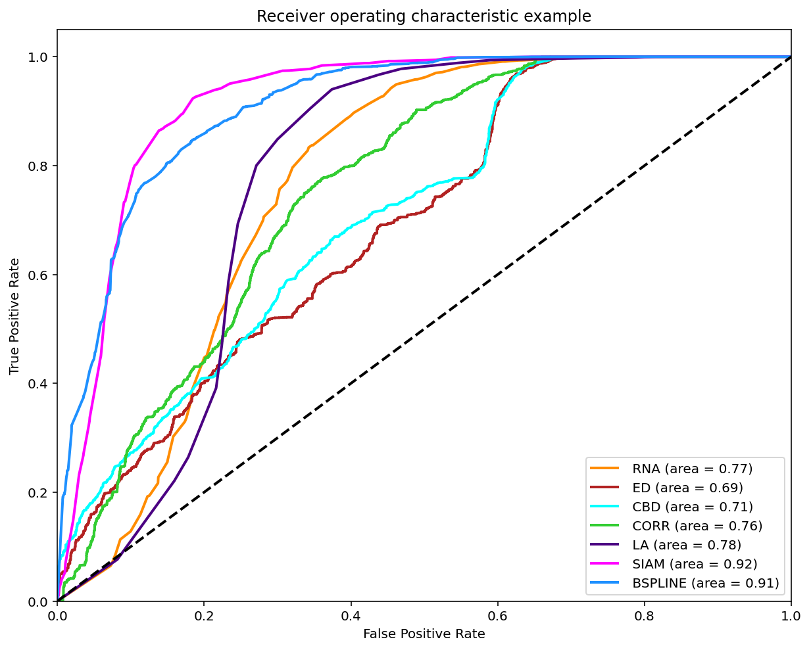
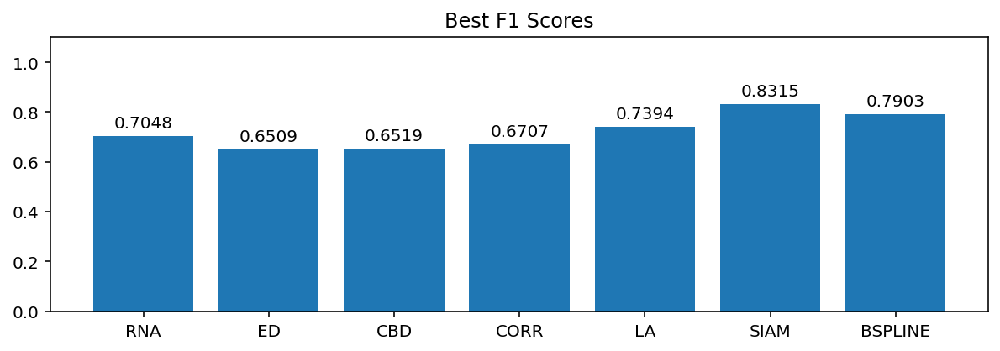
#### Classification (0.5-1)
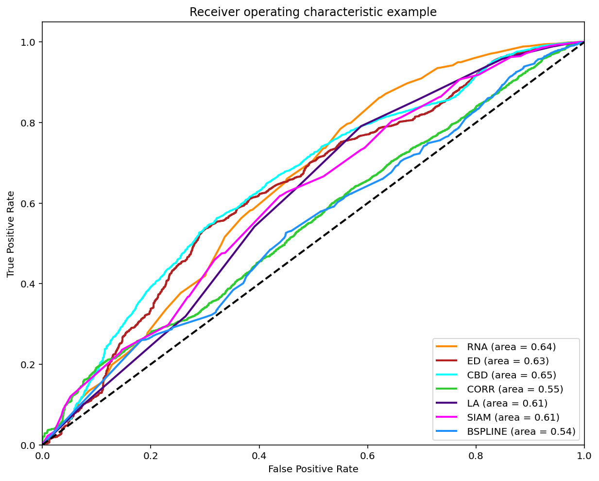
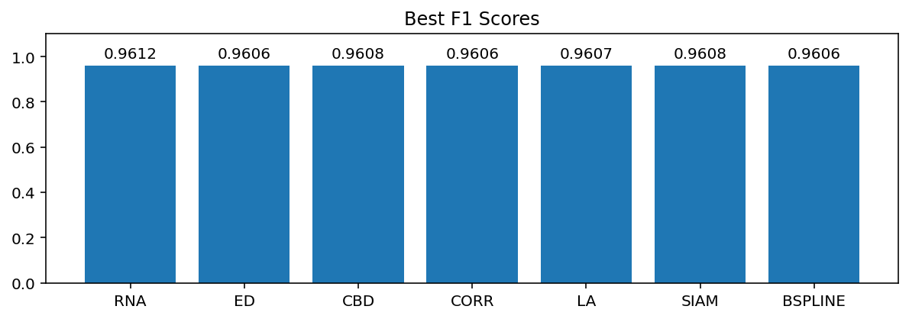
#### Classification (0-1)
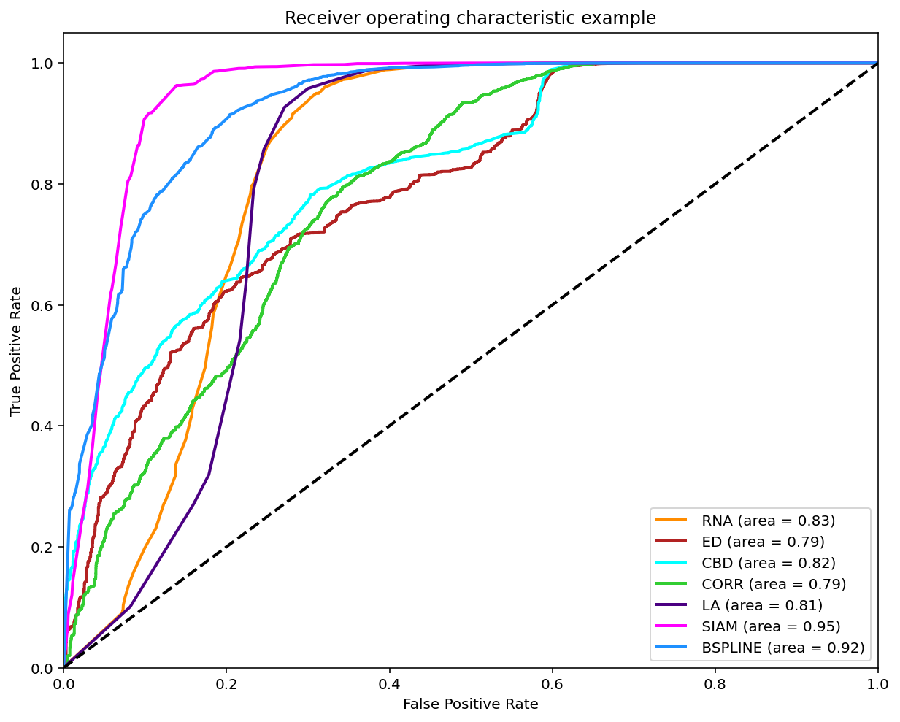
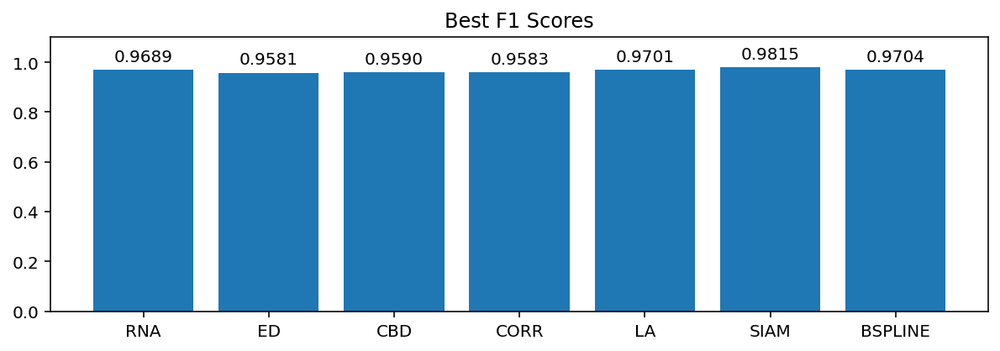

### Summary of F1 Scores

## Case study using Impro-Visor

We used Impro-Visor to test the similarity measures that had the best results in our controlled experiments and for comparison is included a simple measure that is Euclidean Distance. For each group of melodies the similarity was calculated for the X axis to the Corpus created by the user. For the Y axis it was calculated with the corresponding solos of the composer pre-built grammar. For example the Tradings between User and Miles Davis were compared with User's corpus for the X axis and with the grammar solos of Miles Davis for the Y axis.

The following melodies were used:

### Corpus - User
  Original pieces composed by an User, they are 12 measures in length.







### Grammar Solo - Miles Davis
  Using the pre-built grammar for Miles Davis in Impro-Visor, 5 melodies of similar length of 12 measures were generated.
    






### Grammar Solo - Charlie Parker
  Using the pre-built grammar for Charlie Parker in Impro-Visor, 5 melodies of similar length of 12 measures were generated.







### Trading - User & Charlie Parker
  With an active trade using 2 measures for each turn for a total of 12 measures, the User was asked to improvise using the prebuilt grammar of Charlie Parker.






  
### Trading - User & Miles Davis
  With an active trade using 2 measures for each turn for a total of 12 measures, the user was asked to improvise using the prebuilt grammar of Miles Davis.







### Results
**RNA**:
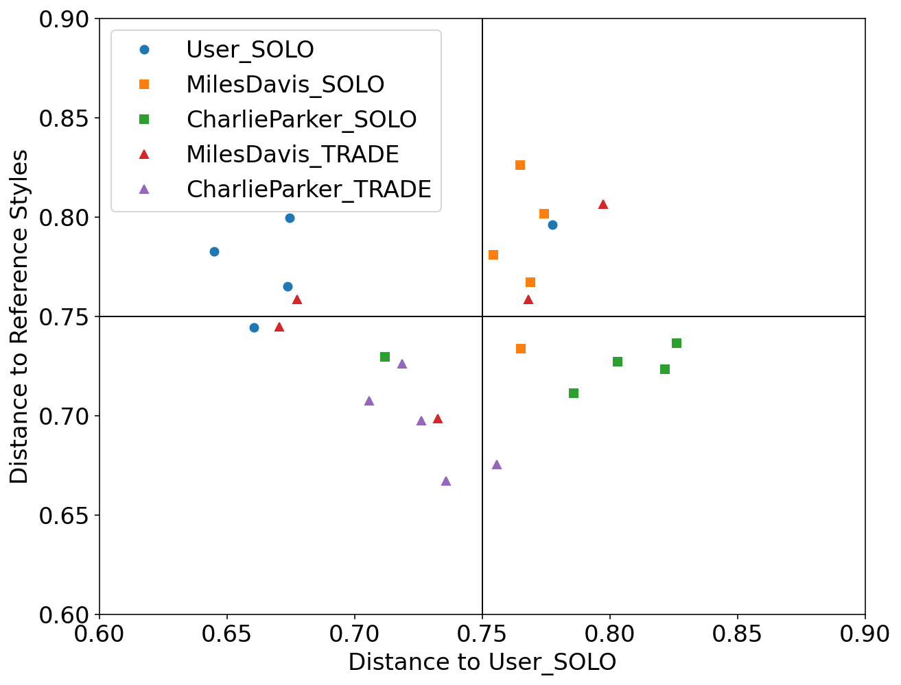
**SIAM**:

**Local Alignment**:

**Euclidean Distance**:

The corresponding Jupyter notebooks can be found in this respository following this [link](https://github.com/Sirivasv/RNA/tree/main/CaseStudy).