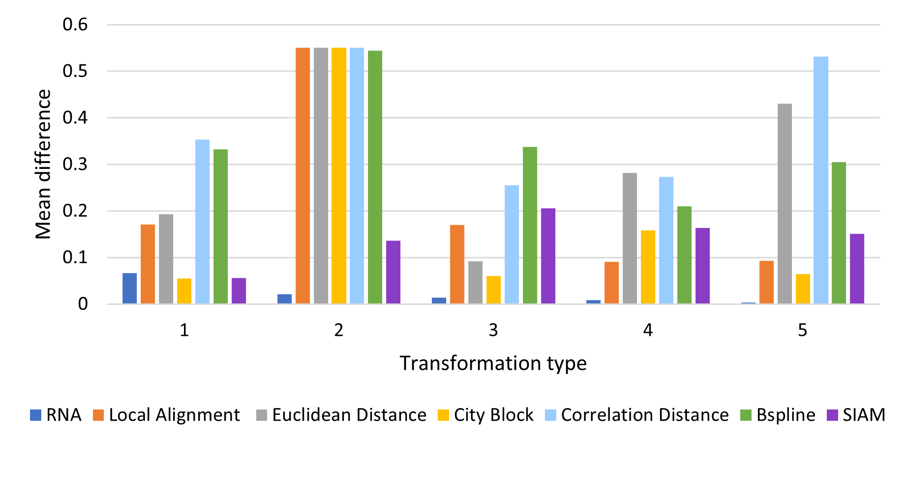
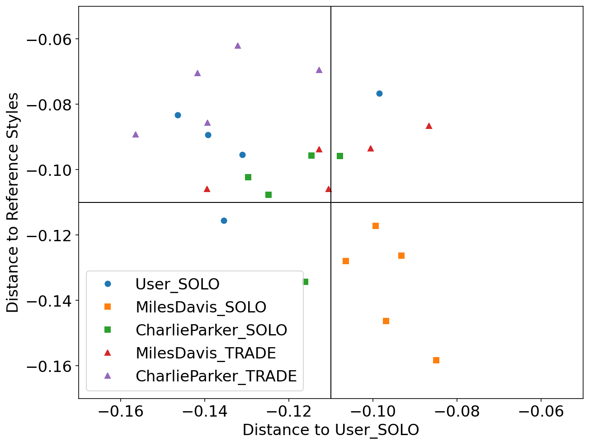
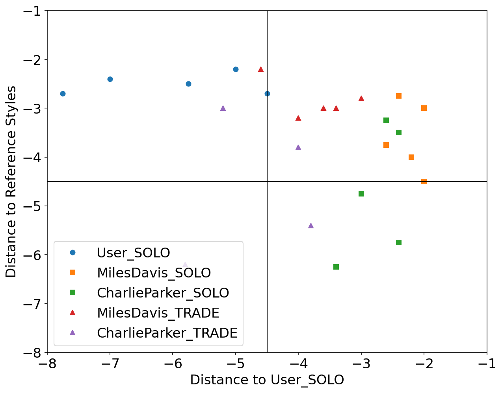

# AlRyNo 

This is the description page for AlRyNo, a symbolic music similarity measure using a modified version of local alignment. AlRyNo uses a substitution function which consider the pitch class and the difference in the onset for each possible match.
We also present a comparison made with these other similarity measures:
  * Euclidean Distance
  * Correlation Distance
  * City Block Distance
  * Local Alignment
  * SIAM
  * BSpline

Based on the work by  [Janssen, et. al. (2015)](https://dspace.library.uu.nl/handle/1874/321370 ) and [Janssen, et. al. (2017)](https://www.tandfonline.com/doi/pdf/10.1080/09298215.2017.1316292). We use the same MTC-ANN dataset, version 2.0.1, available [here](http://www.liederenbank.nl/mtc/#), the pieces were preprocessed just to change the extension to musicxml files.

The following sections describe the experiments and link to the code used on each one.

 * [Controlled Experiments](#controlled-experiments)
 * [Comparison with Expert annotations](#Comparison-with-expert-annotations)
 * [Case study using Impro-Visor](#case-study-using-impro-visor)

## Controlled Experiments

In these experiments a melody is modified with 4 types of modifications and by percentages (10, 20, ..., 100). The expected value from each similarity measure after normalization should be equal to the percentage of the modification, for example a melody modified by 10% should have a distance of 0.1 with the original, and of 1.0 for a 100% modification.

The tested modifications made on the melody are:

 * Pitch: A pitch in a random position is replaced for a random pitch in the MIDI range.
 * Duration: The ticks value for a pitch in a random position is modified with a random value in the range (1 y 4096), the range for a measure in 4/4.
 * Pitch and Duration: A pitch in a random position has both pitch and tick value modified by random values described previously.
 * Elimination: Random notes are removed from the melody.
 * Insertion: Random notes are inserted to the melody.

The experiments were conducted using implementations based from [Janssen](https://github.com/BeritJanssen/MelodicOccurrences) and [Urbano](https://github.com/julian-urbano/MelodyShape) in the case of BSpline.

The corresponding Jupyter notebooks can be found in this respository following this [link](https://github.com/Sirivasv/AlRyNo_draft/tree/main/ControlledExperiments).

### Results

Average Difference by percentage:

Average Difference by Modification Type:

## Comparison with Expert annotations

As reviewed in [Janssen, et. al. (2017)](https://www.tandfonline.com/doi/pdf/10.1080/09298215.2017.1316292) a classification can be made on the matches found when comparing two melodies in order to compare it with the experts annotations by varying the threshold and ploting the ROC curve.

A modified version of this experiment was made, the main difference is using the similarity measures on all the possible comparissons annotated, that is compare each phrase of each tune to each other per tune family using all 7 similarity measures. The annotations are converted to 0 (identical), 0.5 (somewhat similar) and 1.0 (distinct). To make a binary classification we took the 0.5 annotations to 1.0. The reported graph is by taking the majority annotation, if no annotation has the majority the segment is not considered.

The corresponding Jupyter notebooks can be found in this respository following this [link](https://github.com/Sirivasv/AlRyNo_draft/tree/main/ROC_Analysis). The notebook with the results can be found [here](https://github.com/Sirivasv/AlRyNo_draft/blob/main/ROC_Analysis/ROC_ANALYSIS.ipynb).

### Results

## Case study using Impro-Visor

We used Impro-Visor to test the similarity measures that had the best results in our controlled experiments and for comparison is included a simple measure that is Euclidean Distance. For each group of melodies the similarity was calculated for the X axis to the Corpus created by the user. For the Y axis it was calculated with the corresponding solos of the composer pre-built grammar. For example the Tradings between Caleb and Miles Davis were compared with Caleb's corpus for the X axis and with the grammar solos of Miles Davis for the Y axis.

The following melodies were used:

### Corpus - Caleb
  Original pieces composed by co-author Caleb Rascon, they are 12 measures in length.

[probando](./audios/CalebRascon/WAV_CORPUS/rola1.wav)



  1.
  2. 

### Grammar Solo - Miles Davis
  Using the pre-built grammar for Miles Davis in Impro-Visor, 5 melodies of similar length of 12 measures were generated.
    
    1. 
    2.
    3.
    4.
    5.

### Grammar Solo - Charlie Parker
  Using the pre-built grammar for Charlie Parker in Impro-Visor, 5 melodies of similar length of 12 measures were generated.

    1. 
    2.
    3.
    4.
    5.

### Trading - Caleb & Charlie Parker
  With an active trade using 2 measures for each turn for a total of 12 measures, the co-author was asked to improvise using the prebuilt grammar of Charlie Parker.

    1. 
    2.
    3.
    4.
    5.
  
### Trading - Caleb & Miles Davis
  With an active trade using 2 measures for each turn for a total of 12 measures, the co-author was asked to improvise using the prebuilt grammar of Miles Davis.

    1. 
    2.
    3.
    4.
    5.

### Results
AlRyNo:

SIAM:

Local Alignment:

Euclidean Distance:
